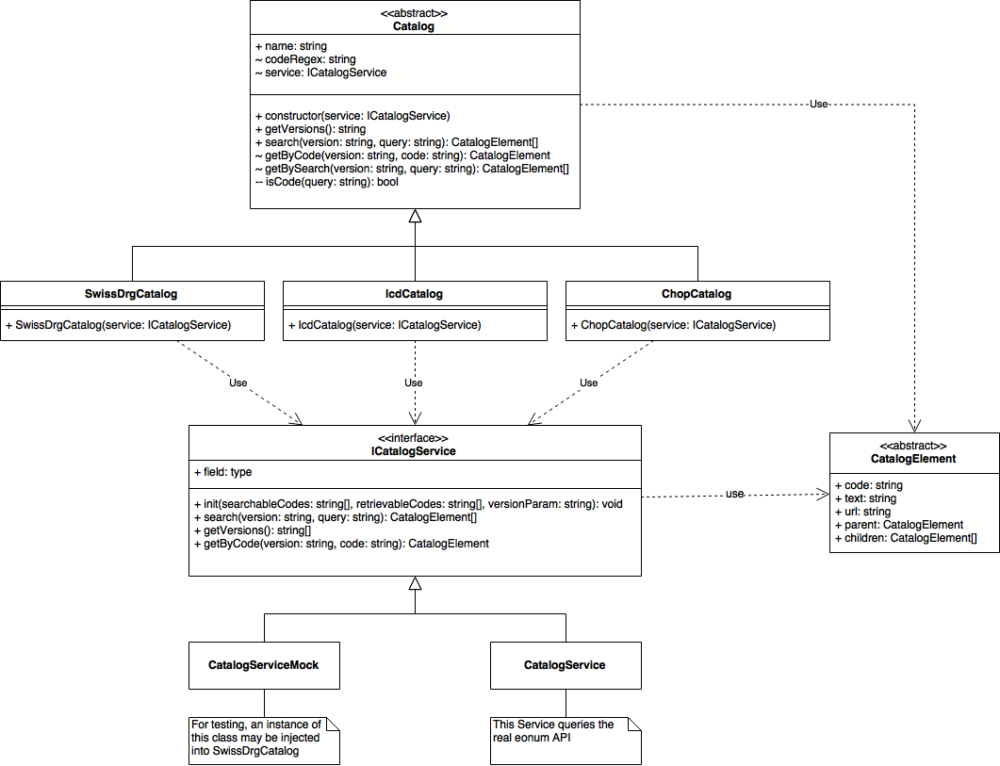

# Architektur eonum search frontend

Die eonum-API kennt drei verschiedene Kataloge. Diese Kataloge weisen zahlreiche Gemeinsamkeiten auf, welche teilweise in eine Oberklasse `Catalog` ausgelagert werden können.

Da jeder Katalog jedoch auch einige Besonderheiten (insbesondere eine andere Objekt-Hierarchie) besitzt, wird jeder Katalog durch eine eigene Klasse modelliert (`SwissDrgCatalog`, `ChopCatalog` und `IcdCatalog`). Katalog-spezifisches Verhalten kann damit gekapselt werden.

Die Kataloge kommunizieren jedoch nicht direkt mit der eonum-API, da dies die Testbarkeit der Kataloge beeinträchtigen würde. Die eonum API wird von Services abgefragt. Jeder Service kapselt dabei die Funktionalität der API für einen spezifischen Katalog. `ISwissDrgService` kapselt den SwissDRG-spezifischen Teil der API, analog für `IChopService` und `IIcdsService`. Unter Umständen können einige Gemeinsamkeiten in einer Service-Oberklasse ausgelagert werden.

Zum Testen können beliebige Fake-Objekte, welche das jeweilige Service-Interface implementieren, im Konstruktor an den Katalog übergeben werden (Dependency Injection).

Die jeweiligen Objekte der Kataloge werden alle mit konkreten Klassen und einer entsprechenden Parent-Child-Hierarchie abgebildet. Gemeinsamkeiten können unter Umständen in eine abstrakte Oberklasse `CatalogElement` ausgelagert werden.