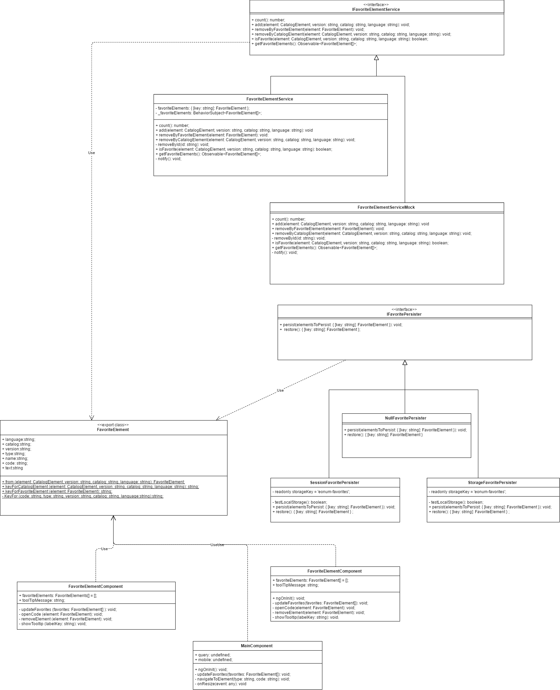

# Architektur Favorite System

Die MedCodeSearch software unterstützt das sichern von favoriten so dass der/die Benutzer/in einen bestimmten code schnell wieder finden kann. In diesem dokument ist die architektur beschreiben. 

Der `IFavoriteElementService` ist ein interface für die Service klasse die das Favorite-Feature anderen klassen zur verfügung stellt.

Die `FavoriteElementService` und `FavoriteElementServiceMock` sind die implementation des zuvor beschriebenen interface. Die erste Klasse ist eine funktionstaugliche implementierung und die Mock Klasse dient zum Testen anderer Klassen.

Die `SessionFavoritePersister` und `StorageFavoritePersister` Klassen nutzen die SessionStorage oder LocalStorage API des Browsers des Benutzers um FavoriteElemente zu sichern. Diese zwei Klassen abstrahieren den zugriff auf die Hardware des Benutzers. Sie werden vom `FavoriteElementService` genutzt um das FavoriteElement zu sichern.

Das `IFavoritePersister` interface erlaubt das freie Austauschen der Klassen `SessionFavoritePersister` und `StorageFavoritePersister`.

Das `FavoriteElementComponent` ist der schlussendliche Benutzer des Features und die Komponente die auf den Benutzer reagiert.

Das `FavoriteElement` selbst modelliert die Daten des Favorite-Code.