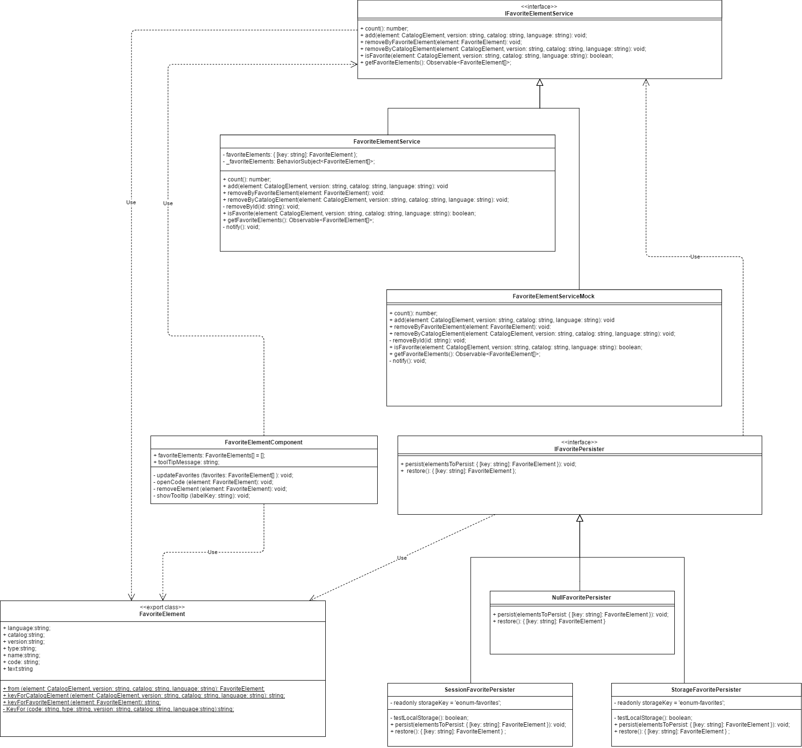

# Architektur Favorite System

Die MedCodeSearch Software unterstützt das Sichern von Favoriten, so dass der/die Benutzer/in einen bestimmten Code schnell wieder finden kann. In diesem Dokument ist die Architektur beschrieben. 

Der `IFavoriteElementService` ist ein Interface für die Service Klasse, die das Favoriten-Feature anderen Klassen zur Verfügung stellt.

Die `FavoriteElementService` und `FavoriteElementServiceMock` sind die Implementatierung des zuvor beschriebenen Interface. Die erste Klasse ist eine funktionstaugliche Implementierung und die Mock Klasse dient zum Testen anderer Klassen.

Die `SessionFavoritePersister` und `StorageFavoritePersister` Klassen nutzen die SessionStorage oder LocalStorage API des Browsers des Benutzers, um FavoriteElemente zu sichern. Diese zwei Klassen abstrahieren den Zugriff auf die Browser-API des Benutzers. Sie werden vom `FavoriteElementService` genutzt um das FavoriteElement zu sichern.

Das `IFavoritePersister` Interface erlaubt das freie Austauschen der Klassen `SessionFavoritePersister` und `StorageFavoritePersister`. Dazu kann in der provide-Direktive von `AppModule` die zu verwendende Implementierung angegeben werden.

Das `FavoriteElementComponent` ist die Konsumenten-Klasse  des Features und die Komponente, welche dem Benutzer entsprechende grafische Buttons und Elemente zur Verwendung der Favoriten-Funktion zur Verfügung stellt.

Das `FavoriteElement` selbst modelliert die Daten des Favorite-Code.
