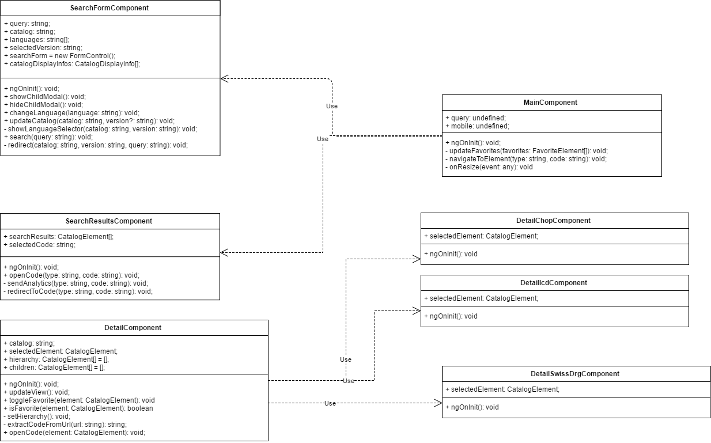

# Architektur Favorite System

In diesem Dokument ist die Architektur der Angular-Komponenten dokumentiert.

Die `MainComponent` dient als Container für die `SearchFormComponent` und `SearchResultsComponent`.

Die `SearchFormComponent` behandelt den Input des Benutzers (auswählen des Kataloges, Eingabe des Suchbegriffes, usw.)

Die `SearchResultsComponent` behandelt das Anzeigen der Resultate der Suche.

Die `DetailComponent` dient zur detaillierten Anzeige eines Codes. Die `DetailChopComponent`, `DetailIcdComponent` , `DetailSwissDrgComponent` dienen zur Anzeige von Katalog-spezifischen Daten eines Codes. 

Ob die `DetailComponent` benutzt wird oder nicht wird vom `app-routing.module` bestimmt.

