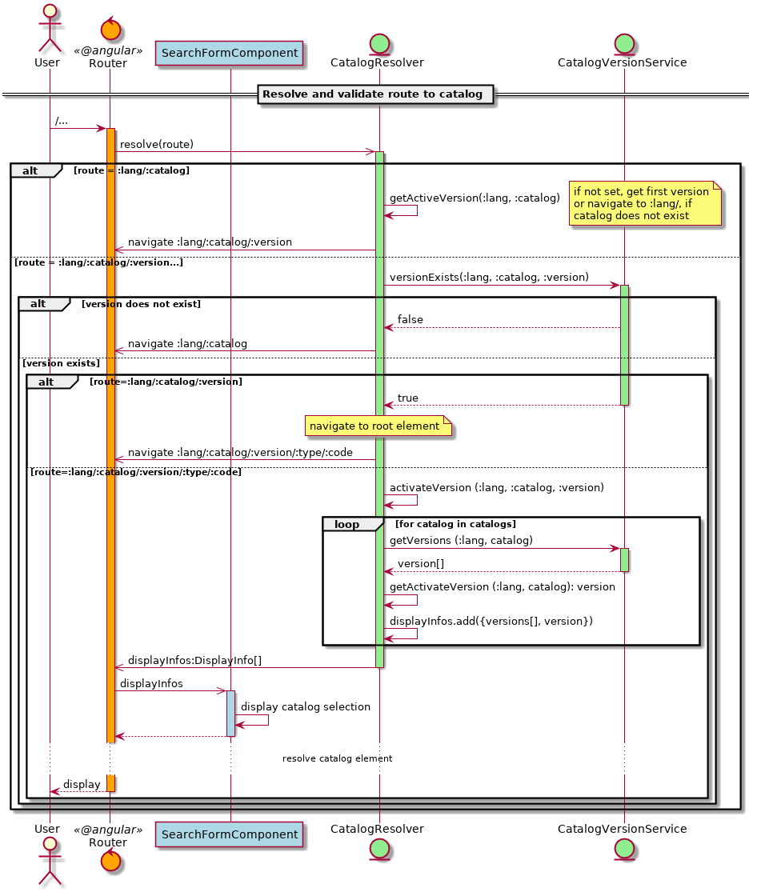
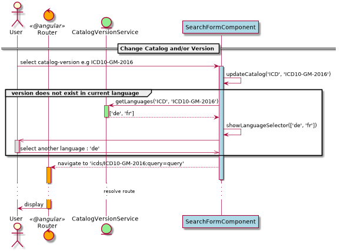
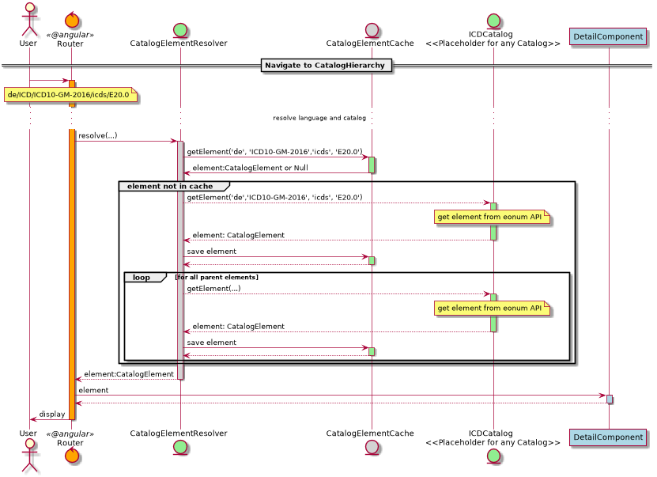

# Routing: Auflösung und Validierung der URL

Die Componenten werden jeweils erst initialisiert, 
nachdem die Route, zu der sie gehören, aufgelöst wurde. 
D.h. DetailComponent wird z.B erst initialisiert, wenn das anzuzeigende 
Element geladen ist. 

Folgendes Diagram veraunschaulicht in welcher Reihenfolge die Komponenten 
initialisiert werden, und welche Route-Parameter und Daten sie beobachten. 

## Katalog Validierung

Auf den Routen `/:lang/:catalog` und `/:lang/:catalog/:version` wird der 
**CatalogResolver** aktiviert um die Route aufzulösen. 

Dabei werden die Parameter validiert, und gegebenenfalls wird auf eine
gültige Version umgeleitet. 
 
Der **CatalogResolver** stellt zudem *displayInfos* für jeden Katalog 
zusammen. 

Diese enthalten alle anzuzeigenden Versionen, verfügbaren 
Versionen, sowie die ausgewählte Version bezüglich der Sprache, und der 
**SearchFormComponent** verwendet diese um die Dropdowns zu füllen. 

## Katalog Wechsel

Wird ein Katalog oder Version ausgewählt, wird die Auswahl, bezüglich der 
ausgewählten Sprache, direkt vom **SearchFormComponent** validiert. 

Ist die Auswahl nicht gültig, wird ein Popup angezeigt um die Sprache 
zu wechseln . 

## Katalog Element wechsel

Auf der Route `:catalog/:version/:type/:code` wird der **CatalogElementResolver**
aktiviert, welcher entsprechend der Route, das Element für den 
**DetailComponent** lädt. 

Entweder befindet sich das Element bereits im **CatalogElementCache**, 
oder wird von der API geladen.  

Es werden zudem alle **Parent**-Elemente geladen, damit
direkt die Breadcrum angezeigt werden kann. 

## Suche

Beim Wechsel des QueryParameter *query*, startet der **SearchResultsComponent**
die Suche. 

Der **CatalogSearchService** ist so aufgebaut, dass immer
nur die neuste Suche gestartet wird, und veraltete ignoriert werden. 

